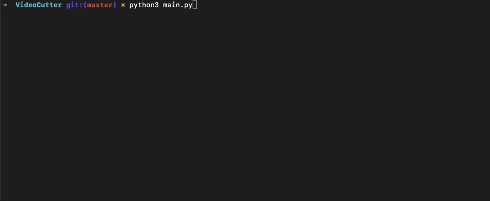

# Face Anonymization

Python script that helps to convert the movie into a set of frames. Just use 1 command and convert all movies you put into the input folder into frames. </br> This is that easy.

## Table of Contents

- [Descripition](#description)

- [Demo](#demo)

- [Installation](#installation)

- [How to use program](#how-to-use-program)

## Description
This program has been created to convert movies into a set of frames (.jpg). </br>
It's been python script that uses OpenCV to manipulate with video. </br>
The main goal of this project was to make this as simple to use as possible - you just have to run 1 command. </br>

## Demo
Below I present a free video from [pexels](https://www.pexels.com/pl-pl/) as example input video: </br>


The results obtained after starting the program are displayed here:
<br />


## Installation
1. Clone the repository.
2. Unzip project.
3. Go to the folder where you unpacked this project.
4. Install all requaired modules: ```cv2, termcolor```.
```
pip3 install opencv-python termcolor
```
6. <b> Please put all videos into the input folder (before starting program). </b>
7. Please run main.py


## How to use program
First, you have to put all videos that you want to divide into frames <b>input</b> folder. </br>Then you have to start programming in the IDE or by using a command ```python3 main.py```.</br> After that program automatically detect all videos in <b>input</b> folder and starts slicing.

The program creates an <b>output</b> folder. Then, for each file with the .mp4 extension. </br>
Please keep in mind that every single frame will be named in this convention: </br>
```<random string seed><frame number>.jpg``` </br> 
This helps to put all files from output directly into for example roboflow without name conflict. </br> </br>

Please tak a look on program at work: </br>

 </br>
Also when programming detect that it already have converted this movie, it won't do it again. </br>
If you still want to convert it again, please took off/delete this frame from output folder. </br>
 </br>

## How to use program
As shown on videos before put all videos that you want to divide into frames <b>input</b> folder. 
</br>Then you have to start programming in the IDE or by using a command ```python3 main.py```.</br> 
After that program automatically detect all videos in <b>input</b> folder start slicing.

The program creates an <b>output</b> folder with sliced video in it.


